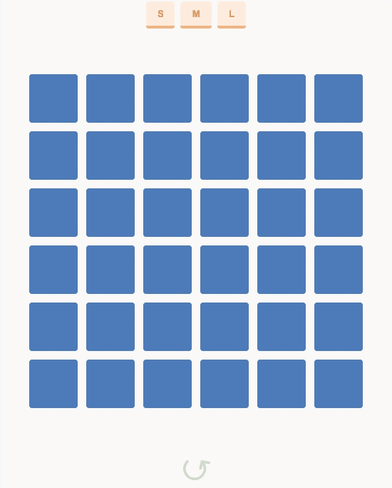

# Getting Started with Create React App

This project was bootstrapped with [Create React App](https://github.com/facebook/create-react-app).

## Basic info

Demo challenge where a 6x6 grid is displayed where:
 - On click a tile, the tile should flip
 - On doubleClick a tile, the full column should flip
 - On click+hold+drag, all area selected should flip according to the initial tile selected

 

Check the result [here](https://torian12321.github.io/react-tiles/)

## Setup Instructions

To compile the project locally, run `npm install` and then `npm start`, App will run at http://localhost:3000/

To build a production copy, run `npm build`

## Technologies
  - [React](https://reactjs.org/)
  - [Redux](https://redux.js.org/)
  - [Typescript](https://www.typescriptlang.org/)
  - [CSS-modules](https://github.com/css-modules/css-modules)
  - [SASS](https://sass-lang.com/)

## TODO

 - Add alias to project
 - Add styleguide with [storyboock](https://storybook.js.org/) or [react-styleguidist](https://react-styleguidist.js.org/)
 - Fix doubleClick and click and drag for mobile devices
